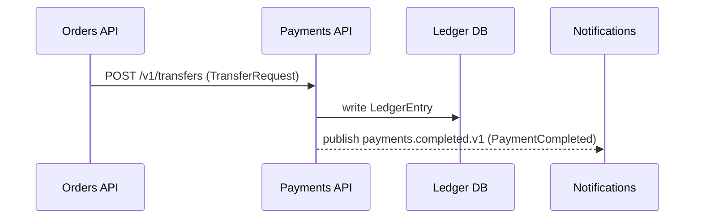

Data flow must be captured **twice**: a Mermaid diagram for humans, and a flow table for
agents. Diagrams are great for a person scanning relationships and useless for a program
trying to parse "what happens when X arrives." The table is the source of truth; the diagram
is generated to match it. They must never disagree.

## The flow table (machine-readable, required)

One table per service. Each row is one step in a flow, grouped by the inbound trigger. Cover
both the happy path and the **failure/compensation** path.

| flow | step | actor | action | input | output / effect | downstream | outcome / compensation |
|---|---|---|---|---|---|---|---|
| record-payment | 1 | Orders API | POST `/v1/transfers` | TransferRequest | — | payments-api | — |
| record-payment | 2 | Payments API | validate + write ledger | TransferRequest | LedgerEntry | ledger-db | committed |
| record-payment | 3 | Payments API | publish completion | LedgerEntry | `payments.completed.v1` (PaymentCompleted) | notifications, reporting | success |
| record-payment | 2f | Payments API | validation/ledger fails | TransferRequest | `payments.failed.v1` (PaymentFailed) | orders-api | **compensation:** no ledger write; caller cancels |
| order-placed | 1 | (broker) | deliver `orders.placed.v1` | OrderPlaced | — | payments-api | — |
| order-placed | 2 | Payments API | create transfer | OrderPlaced | LedgerEntry | ledger-db | committed |
| order-placed | 2f | Payments API | handler throws | OrderPlaced | nack → `orders.placed.dlq` | (DLQ) | **retry then DLQ** |

Column meaning:
- **flow** — a stable kebab-case name for the end-to-end scenario; lets an agent select all
  rows of one flow.
- **step** — order within the flow. Number the happy path `1, 2, 3…`; suffix
  failure/compensation steps `2f, 3f…` so both paths share the flow id but read distinctly.
- **actor** — who performs the step (this service, an upstream caller, or `(broker)` for a
  message delivery).
- **action** — the verb. For HTTP, the method+path; for messaging, publish/consume.
- **input / output** — message or DTO **types** (and topic for messages).
- **downstream** — the `service_id`(s) or store affected. This is the edge target. `(DLQ)` for
  a dead-letter destination.
- **outcome / compensation** — the terminal state of the step and, for an `f` row, the
  compensating action / DLQ / retry behavior. This is the column `_process-flows.md` lifts to
  stitch the system-level saga.

Every inbound trigger (HTTP endpoint that starts a flow, or a consumed topic) must begin a
flow in this table, with at least its happy path and — where the trigger can fail — its
failure/compensation rows. An agent reading the table can reconstruct the whole graph,
including the unhappy path, without the diagram.

## The Mermaid diagram (for humans)

Generate from the same rows. Use a **sequence diagram** for a single flow's time order, or a
**flowchart** for the service's overall fan-in/fan-out.

Sequence (per important flow):


Flowchart (service overview):
```mermaid
flowchart LR
    orders[Orders API] -->|POST /v1/transfers| payments[Payments API]
    broker((orders.placed.v1)) -.-> payments
    payments --> ledger[(Ledger DB)]
    payments -.payments.completed.v1.-> notifications[Notifications]
```

## Edge & shape conventions (consistent across all docs)

- **Solid arrow** `-->` / `->>` = **synchronous HTTP** call. Label with `METHOD /path`.
- **Dashed arrow** `-.->` / `-->>` = **asynchronous message**. Label with the **topic name**.
- **`[Service]`** rectangle = a service. **`[(Store)]`** = a database. **`((topic))`** =
  a broker topic/queue when shown as a node.
- Direction `LR` for overview flowcharts; sequence diagrams read top-down by time.

The same conventions scale up to `_system-dataflow.md` (the whole-system graph, see
`system-catalog-template`) and to `_process-flows.md` (one business process stitched across
services with its compensation path, see `system-context-and-flows`). A per-service failure row
here is what those system-level docs join on — write it once, well, and it is reused upward.

## Keeping the two in sync
- Write the table first, generate the diagram from it. If you edit one, edit both.
- Every diagram edge must correspond to a table row's `actor → downstream`. No edge without a
  row; no flow-starting row without an edge.
- A reviewer checks: does each Mermaid arrow appear as a table row, and vice versa?

## Cautions
- Don't draw infrastructure noise (health checks, metrics scrapes, auth-token fetches) — only
  business data flow.
- Don't stop at the happy path. A trigger that can decline/reject/throw needs its `f` rows and
  a terminal outcome — the failure path is half the data flow and the part agents most need.
- Keep a single sequence diagram to one flow. Multiple flows in one diagram become unreadable;
  give each its own.
- If Mermaid syntax would get elaborate (loops, alt/opt), prefer splitting flows over a clever
  single diagram — readability wins, and the table carries the precise semantics anyway.
