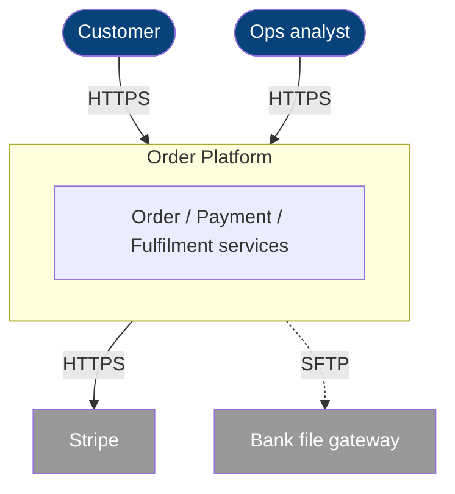
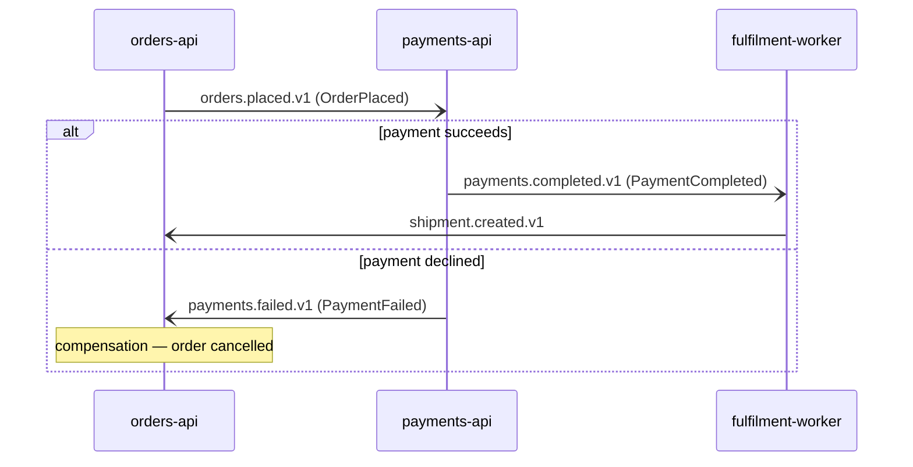

Per-service docs zoom into one service; `_system-dataflow.md` draws the whole graph at once.
Neither answers the two questions a human onboarding or an agent planning a multi-service task
asks first: **"what's outside the system and who uses it?"** (context) and **"how does
*process X* actually run from start to finish?"** (process flow). This skill defines those two
aggregate docs. Both are derived from the per-service docs and the integration graphs — never
hand-authored facts.

Reuse the edge convention from `dataflow-diagrams` everywhere: **solid = HTTP, dashed =
message (label = topic)**.

## Part 1 — `_system-context.md` (C4 Level 1)

The boundary view. One box for the whole system, surrounded by the **people** who use it and
the **external systems** it integrates with. This is the C4 level the per-service architecture
diagrams deliberately skip — draw it once, here.

### Actors / external systems table

| name | kind | interacts via | entry service | purpose |
|---|---|---|---|---|
| Customer | person | HTTPS (web/app) | orders-api | places and tracks orders |
| Ops analyst | person | HTTPS (admin UI) | reporting-api | monitors settlement |
| Stripe | external-system | HTTPS (outbound) | payments-api | card capture / payout |
| Bank file gateway | external-system | SFTP (outbound) | settlement-worker | end-of-day settlement files |

- **kind** is `person` or `external-system` — the two C4 actor types. Internal services are
  *not* actors here; they live inside the boundary.
- **entry service** is the in-scope `service_id` the actor touches first — the seam between
  outside and inside. It must exist in `_service-catalog.md`.
- Derive actors from per-service "Role in the system → Upstream" entries that resolve to
  `external`, plus the supplied business input for human actors. If the set of human actors
  isn't supplied, mark it: `> Input needed: which human roles initiate or monitor this system?`

### Context diagram

Keep it to one box for the system plus its actors and external systems — no internal services.
If there are clear sub-systems (bounded-context clusters), show them as a few boxes inside the
boundary, not the full service list (that's `_system-dataflow.md`'s job).

## Part 2 — `_process-flows.md` (end-to-end sagas)

A **process flow** traces one business process across every service it touches, from the
triggering event to the terminal outcome — and, separately, the **failure/compensation** path.
This is what turns a pile of per-service flow tables into "how the system works."

One H2 per process. Name it from business input (e.g. *Order-to-Cash*); if the name isn't
supplied, derive a descriptive one and mark it `> Input needed: confirm the business name…`.

### Choreography vs orchestration — say which

State the coordination style up front, because it changes how a reader reasons about the flow:
- **Choreography** — no central coordinator; each service reacts to an event and emits the
  next. The flow is a chain of `correlationId`-linked topics. Most Solace flows are this.
- **Orchestration** — a coordinator service drives the steps and owns the saga state. Name the
  coordinator.

### The system flow table (machine-readable, required)

Same shape as the per-service flow table in `dataflow-diagrams`, with two system-level
additions: every row names the **service** that acts, and an **outcome / compensation** column
carries the failure side.

| flow | step | service | action | input | output / effect | downstream | outcome / compensation |
|---|---|---|---|---|---|---|---|
| order-to-cash | 1 | orders-api | POST `/v1/orders` → publish | OrderRequest | `orders.placed.v1` (OrderPlaced) | payments-api | order persisted |
| order-to-cash | 2 | payments-api | consume → write ledger → publish | OrderPlaced | `payments.completed.v1` (PaymentCompleted) | fulfilment-worker | payment recorded |
| order-to-cash | 3 | fulfilment-worker | consume → reserve stock | PaymentCompleted | `shipment.created.v1` | notifications | order fulfilled |
| order-to-cash | 2f | payments-api | payment declined → publish | OrderPlaced | `payments.failed.v1` (PaymentFailed) | orders-api | **compensation:** order cancelled |
| order-to-cash | 3f | orders-api | consume failure → cancel order | PaymentFailed | order set `Cancelled` | customer | saga ends, no shipment |

Conventions:
- **flow** is a stable kebab-case process id; an agent selects all rows of one process by it.
- Number the happy path `1, 2, 3…`; suffix failure/compensation steps `2f, 3f…` so the two
  paths are visually distinct but share the flow id.
- **service** is an in-scope `service_id` or `(broker)` for a pure delivery hop. Every step must
  trace to a row in that service's own flow table — the process view stitches existing rows,
  it never invents a step.
- **outcome / compensation** is the column that makes this doc worth more than the graph: it
  says what state the saga is left in and which compensating action undoes a partial success.

### Stitching on the correlation key

Link step N's published topic to step N+1's consumed topic via the **`correlationId`** recorded
in `_message-registry.md` (e.g. `orderId`). If two adjacent services share no correlation key,
you cannot prove the steps belong to one saga — record the break as
`> Unresolved: cannot link <topicA> → <topicB>; no shared correlation key found` rather than
assuming the connection.

### The cross-service sequence diagram (for humans)

Generate from the same rows. One diagram per process; show the failure path with an `alt`
block so the happy and compensation paths read together.

Use `-)` (async) for message edges and `->>` (sync) for HTTP, matching the solid/dashed
convention. Keep one process per diagram; split if it exceeds ~8 participants.

## Keeping context and flows honest
- **Derive, don't invent.** Context actors come from per-service `external` upstreams + business
  input; flow steps come from per-service flow tables. A step or actor with no backing source is
  a defect, not a convenience.
- **Mark, don't guess.** Missing business names, unprovable saga links, and unknown compensation
  paths get explicit markers — a marked gap tells the user what to supply.
- **Both paths, always.** A process flow without its failure/compensation path documents half
  the system. If a process genuinely has no failure branch, say so in one line.
- Keep diagrams readable (≤ ~8 participants / ~12 nodes); the table carries the precise
  semantics, the diagram carries the intuition.
